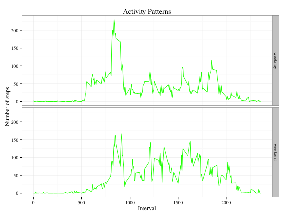

# Reproducible Research: Peer Assessment 1
===========================================


## Loading and preprocessing the data

Downloda the raw data and read the data into Memory.

```r
act<-read.csv("/Users/garfield/peer/activity.csv")
head(act,2)
```

```
##   steps       date interval
## 1    NA 2012-10-01        0
## 2    NA 2012-10-01        5
```

Transform the date into date formate

```r
act$date<-as.Date(act$date, format= "%Y-%m-%d")
class(act$date)
```

```
## [1] "Date"
```


## What is mean total number of steps taken per day?

Make a histogram of the total number of steps taken each day

```r
library(plyr)
daysteps<-ddply(act,.(date),summarize,
         sum=sum(steps,na.rm=TRUE))
hist(daysteps$sum,xlab="Steps",main="Total Number of Steps Taken Each Day")
```

 

Calculate and report the mean and median total number of steps taken per day

```r
sapply(list(daysteps$sum),
       function(x){
           print(paste("mean of total number of steps taken per day is ",
                       round(mean(x),1)))
           paste("median of total number of steps taken per day is ",
                       round(median(x),1))
           })
```

```
## [1] "mean of total number of steps taken per day is  9354.2"
```

```
## [1] "median of total number of steps taken per day is  10395"
```


## What is the average daily activity pattern?

```r
library(plyr)
meanInterval<-ddply(act,.(interval),summarize,
               mean=mean(steps,na.rm=TRUE))
maxInterval<-meanInterval[which.max(meanInterval$mean),][1]
print(paste("On average across all the days,the",maxInterval,
            "interval contains the maximum number of steps",sep=" "))
```

```
## [1] "On average across all the days,the 835 interval contains the maximum number of steps"
```

```r
plot(meanInterval$interval,meanInterval$mean,type = "l",
     xlab="interval",ylab="number of steps",main="Average Daily Activity Pattern")
```

 

## Imputing missing values
Calculate and report the total number of missing values in the dataset

```r
nasNum<-sum(is.na(act$steps))
print(paste("The total number of rows with NAs is",nasNum,sep=" "))
```

```
## [1] "The total number of rows with NAs is 2304"
```
Create a new dataset without missing values

```r
actnona<-act[c("date","interval")]
for(i in 1:nrow(actnona)){
        if(is.na(act$steps[i])){
                actnona$steps[i]<-meanInterval[meanInterval[1]==act[i,"interval"],2]
        }
        else actnona$steps[i]<-act$steps[i]
}
head(actnona,2)
```

```
##         date interval  steps
## 1 2012-10-01        0 1.7170
## 2 2012-10-01        5 0.3396
```
Make a histogram of the total number of steps taken each day.

```r
library(plyr)
newTotalsteps<-ddply(actnona,.(date),summarize,
                     sum=sum(steps,na.rm=TRUE))
hist(newTotalsteps$sum,xlab="totalsteps",main="Total Number of Steps(missing values were imputed)")
```

 

Calculate and report the mean and median total number of steps taken per day

```r
lapply(list(newTotalsteps$sum),
       function(x){
           me<-round(mean(x),1)
           med<-round(median(x),1)
paste("mean=",me,"median=",med)})
```

```
## [[1]]
## [1] "mean= 10766.2 median= 10766.2"
```


## Are there differences in activity patterns between weekdays and weekends?
Create a new factor variable in the dataset with two levels "weekday" and "weekend"


```r
actnona$weekdays<-ifelse(
        weekdays(actnona$date)=="Saturday"|weekdays(actnona$date)=="Sunday"
        ,"weekend","weekday")
actnona$weekdays<-factor(actnona$weekdays)
```
Make a panel plot of the interval and the average number of steps taken

```r
library(plyr)
actnonaInterval<-ddply(actnona,.(interval,weekdays),summarize,mean=mean(steps))
library("ggplot2")
ggplot(actnonaInterval,aes(x=interval,y=mean))+
        geom_line(colour="green")+
        facet_grid(weekdays~.)+
        labs(title="Activity Patterns",x="Interval",y="Number of steps")+
        theme_bw(base_family = "Times")
```

 
