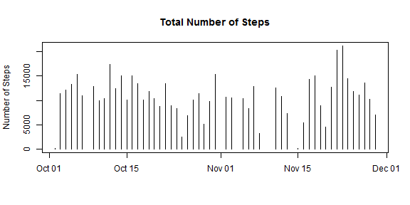
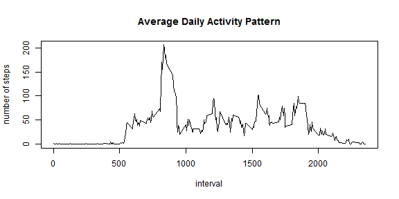
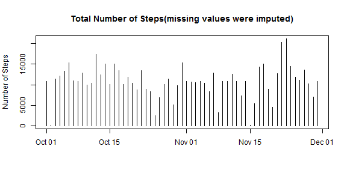
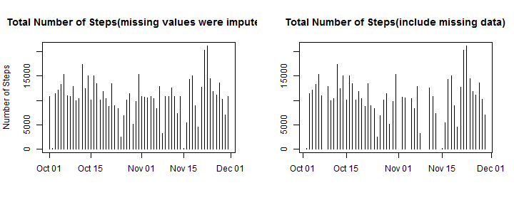
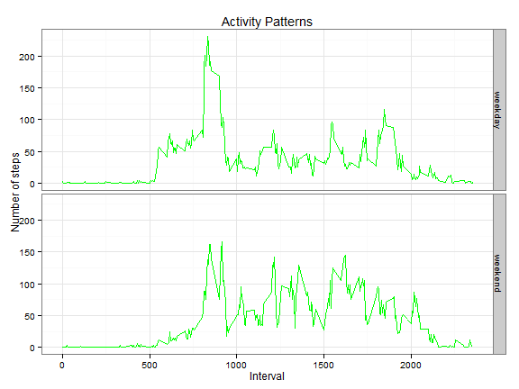

# Reproducible Research: Peer Assessment 1
===========================================


## Loading and preprocessing the data

Downloda the raw data and read the data into Memory.

```r
act<-read.csv("D:/rprog-data-ProgAssignment3-data/activity.csv")
head(act,2)
```

```
##   steps       date interval
## 1    NA 2012-10-01        0
## 2    NA 2012-10-01        5
```

Transform the date into date formate

```r
act$date<-as.Date(act$date, format= "%Y-%m-%d")
class(act$date)
```

```
## [1] "Date"
```


## What is mean total number of steps taken per day?

Make a histogram of the total number of steps taken each day


```r
plot(unique(act[!is.na(act$steps),"date"])
     ,tapply(act[!is.na(act$steps),"steps"],act[!is.na(act$steps),"date"],sum)
     ,type="h",main="Total Number of Steps",ylab="Number of Steps",xlab=NA)
```

 

Calculate and report the mean and median total number of steps taken per day

```r
library("plyr")
a<-ddply(act,.(date),summarize,
         mean=mean(steps,na.rm=TRUE),
         median=median(steps,na.rm=TRUE))
print(a)
```

```
##          date    mean median
## 1  2012-10-01     NaN     NA
## 2  2012-10-02  0.4375      0
## 3  2012-10-03 39.4167      0
## 4  2012-10-04 42.0694      0
## 5  2012-10-05 46.1597      0
## 6  2012-10-06 53.5417      0
## 7  2012-10-07 38.2465      0
## 8  2012-10-08     NaN     NA
## 9  2012-10-09 44.4826      0
## 10 2012-10-10 34.3750      0
## 11 2012-10-11 35.7778      0
## 12 2012-10-12 60.3542      0
## 13 2012-10-13 43.1458      0
## 14 2012-10-14 52.4236      0
## 15 2012-10-15 35.2049      0
## 16 2012-10-16 52.3750      0
## 17 2012-10-17 46.7083      0
## 18 2012-10-18 34.9167      0
## 19 2012-10-19 41.0729      0
## 20 2012-10-20 36.0938      0
## 21 2012-10-21 30.6285      0
## 22 2012-10-22 46.7361      0
## 23 2012-10-23 30.9653      0
## 24 2012-10-24 29.0104      0
## 25 2012-10-25  8.6528      0
## 26 2012-10-26 23.5347      0
## 27 2012-10-27 35.1354      0
## 28 2012-10-28 39.7847      0
## 29 2012-10-29 17.4236      0
## 30 2012-10-30 34.0938      0
## 31 2012-10-31 53.5208      0
## 32 2012-11-01     NaN     NA
## 33 2012-11-02 36.8056      0
## 34 2012-11-03 36.7049      0
## 35 2012-11-04     NaN     NA
## 36 2012-11-05 36.2465      0
## 37 2012-11-06 28.9375      0
## 38 2012-11-07 44.7326      0
## 39 2012-11-08 11.1771      0
## 40 2012-11-09     NaN     NA
## 41 2012-11-10     NaN     NA
## 42 2012-11-11 43.7778      0
## 43 2012-11-12 37.3785      0
## 44 2012-11-13 25.4722      0
## 45 2012-11-14     NaN     NA
## 46 2012-11-15  0.1424      0
## 47 2012-11-16 18.8924      0
## 48 2012-11-17 49.7882      0
## 49 2012-11-18 52.4653      0
## 50 2012-11-19 30.6979      0
## 51 2012-11-20 15.5278      0
## 52 2012-11-21 44.3993      0
## 53 2012-11-22 70.9271      0
## 54 2012-11-23 73.5903      0
## 55 2012-11-24 50.2708      0
## 56 2012-11-25 41.0903      0
## 57 2012-11-26 38.7569      0
## 58 2012-11-27 47.3819      0
## 59 2012-11-28 35.3576      0
## 60 2012-11-29 24.4688      0
## 61 2012-11-30     NaN     NA
```


## What is the average daily activity pattern?

```r
library(plyr)
meanInterval<-ddply(act,.(interval),summarize,
               mean=mean(steps,na.rm=TRUE))
maxInterval<-meanInterval[which.max(meanInterval$mean),][1]
print(paste("On average across all the days,the",maxInterval,
            "interval contains the maximum number of steps",sep=" "))
```

```
## [1] "On average across all the days,the 835 interval contains the maximum number of steps"
```

```r
plot(meanInterval$interval,meanInterval$mean,type = "l",
     xlab="interval",ylab="number of steps",main="Average Daily Activity Pattern")
```

 

## Imputing missing values
Calculate and report the total number of missing values in the dataset

```r
nasNum<-sum(is.na(act$steps))
print(paste("The total number of rows with NAs is",nasNum,sep=" "))
```

```
## [1] "The total number of rows with NAs is 2304"
```
Create a new dataset without missing values

```r
actnona<-act[c("date","interval")]
for(i in 1:nrow(actnona)){
        if(is.na(act$steps[i])){
                actnona$steps[i]<-meanInterval[meanInterval[1]==act[i,"interval"],2]
        }
        else actnona$steps[i]<-act$steps[i]
}
head(actnona,2)
```

```
##         date interval  steps
## 1 2012-10-01        0 1.7170
## 2 2012-10-01        5 0.3396
```
Create a new dataset that is equal to the original dataset but with the missing data filled in.


```r
plot(unique(actnona[!is.na(actnona$steps),"date"])
     ,tapply(actnona[!is.na(actnona$steps),"steps"],
             actnona[!is.na(actnona$steps),"date"],sum,na.rm=TRUE)
     ,type="h",main="Total Number of Steps(missing values were imputed)",
     xlab=NA,ylab="Number of Steps"
     )
```

 
Calculate and report the mean and median total number of steps taken per day

```r
library(plyr)
a<-ddply(actnona,.(date),summarize,
         mean=mean(steps,na.rm=TRUE),
         median=median(steps,na.rm=TRUE))
print(a)
```

```
##          date    mean median
## 1  2012-10-01 37.3826  34.11
## 2  2012-10-02  0.4375   0.00
## 3  2012-10-03 39.4167   0.00
## 4  2012-10-04 42.0694   0.00
## 5  2012-10-05 46.1597   0.00
## 6  2012-10-06 53.5417   0.00
## 7  2012-10-07 38.2465   0.00
## 8  2012-10-08 37.3826  34.11
## 9  2012-10-09 44.4826   0.00
## 10 2012-10-10 34.3750   0.00
## 11 2012-10-11 35.7778   0.00
## 12 2012-10-12 60.3542   0.00
## 13 2012-10-13 43.1458   0.00
## 14 2012-10-14 52.4236   0.00
## 15 2012-10-15 35.2049   0.00
## 16 2012-10-16 52.3750   0.00
## 17 2012-10-17 46.7083   0.00
## 18 2012-10-18 34.9167   0.00
## 19 2012-10-19 41.0729   0.00
## 20 2012-10-20 36.0938   0.00
## 21 2012-10-21 30.6285   0.00
## 22 2012-10-22 46.7361   0.00
## 23 2012-10-23 30.9653   0.00
## 24 2012-10-24 29.0104   0.00
## 25 2012-10-25  8.6528   0.00
## 26 2012-10-26 23.5347   0.00
## 27 2012-10-27 35.1354   0.00
## 28 2012-10-28 39.7847   0.00
## 29 2012-10-29 17.4236   0.00
## 30 2012-10-30 34.0938   0.00
## 31 2012-10-31 53.5208   0.00
## 32 2012-11-01 37.3826  34.11
## 33 2012-11-02 36.8056   0.00
## 34 2012-11-03 36.7049   0.00
## 35 2012-11-04 37.3826  34.11
## 36 2012-11-05 36.2465   0.00
## 37 2012-11-06 28.9375   0.00
## 38 2012-11-07 44.7326   0.00
## 39 2012-11-08 11.1771   0.00
## 40 2012-11-09 37.3826  34.11
## 41 2012-11-10 37.3826  34.11
## 42 2012-11-11 43.7778   0.00
## 43 2012-11-12 37.3785   0.00
## 44 2012-11-13 25.4722   0.00
## 45 2012-11-14 37.3826  34.11
## 46 2012-11-15  0.1424   0.00
## 47 2012-11-16 18.8924   0.00
## 48 2012-11-17 49.7882   0.00
## 49 2012-11-18 52.4653   0.00
## 50 2012-11-19 30.6979   0.00
## 51 2012-11-20 15.5278   0.00
## 52 2012-11-21 44.3993   0.00
## 53 2012-11-22 70.9271   0.00
## 54 2012-11-23 73.5903   0.00
## 55 2012-11-24 50.2708   0.00
## 56 2012-11-25 41.0903   0.00
## 57 2012-11-26 38.7569   0.00
## 58 2012-11-27 47.3819   0.00
## 59 2012-11-28 35.3576   0.00
## 60 2012-11-29 24.4688   0.00
## 61 2012-11-30 37.3826  34.11
```
The shape of the distributione is't change,but the more missing valuse,the more sparse lines 


```r
par(mfcol=c(1,2))
plot(unique(actnona[!is.na(actnona$steps),"date"])
     ,tapply(actnona[!is.na(actnona$steps),"steps"],
             actnona[!is.na(actnona$steps),"date"],sum)
     ,type="h",main="Total Number of Steps(missing values were imputed)",
     xlab=NA,ylab="Number of Steps"
)
plot(unique(act[!is.na(act$steps),"date"])
     ,tapply(act[!is.na(act$steps),"steps"],
             act[!is.na(act$steps),"date"],sum)
     ,type="h",main="Total Number of Steps(include missing data)",
     xlab=NA,ylab=NA
)
```

 


## Are there differences in activity patterns between weekdays and weekends?
Create a new factor variable in the dataset with two levels "weekday" and "weekend"


```r
actnona$weekdays<-ifelse(
        weekdays(actnona$date)=="Saturday"|weekdays(actnona$date)=="Sunday"
        ,"weekend","weekday")
actnona$weekdays<-factor(actnona$weekdays)
```
Make a panel plot of the interval and the average number of steps taken

```r
library(plyr)
actnonaInterval<-ddply(actnona,.(interval,weekdays),summarize,mean=mean(steps))
library("ggplot2")
ggplot(actnonaInterval,aes(x=interval,y=mean))+
        geom_line(colour="green")+
        facet_grid(weekdays~.)+
        labs(title="Activity Patterns",x="Interval",y="Number of steps")+
        theme_bw(base_family = "Times")
```

 
